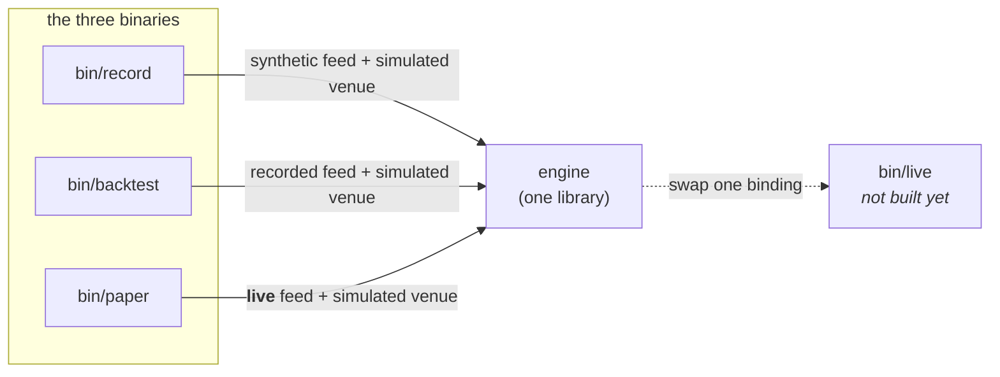
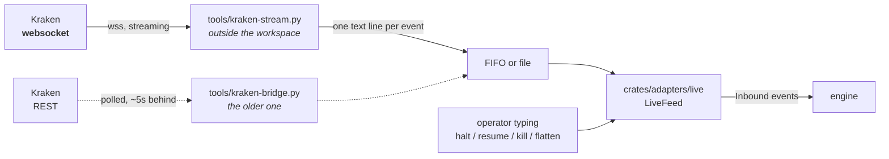
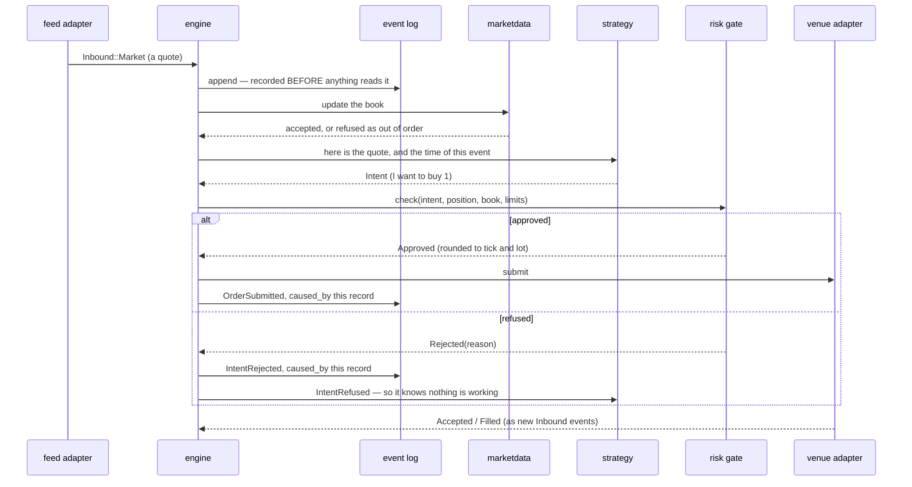
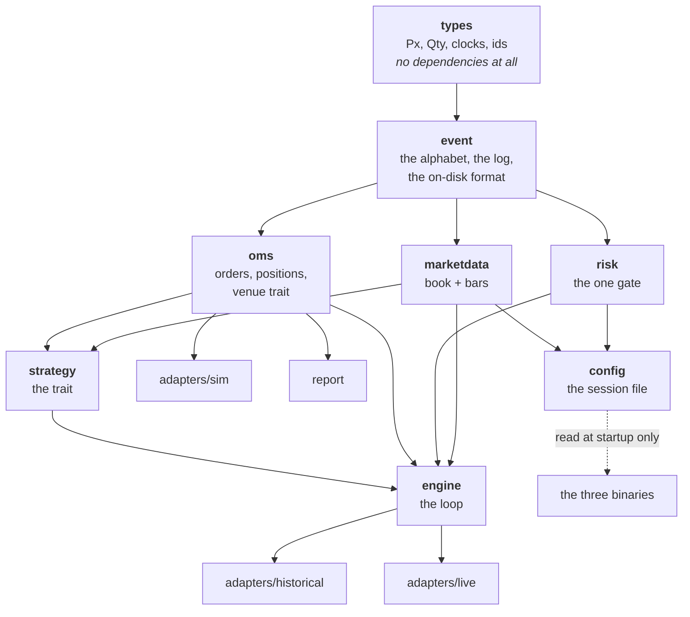
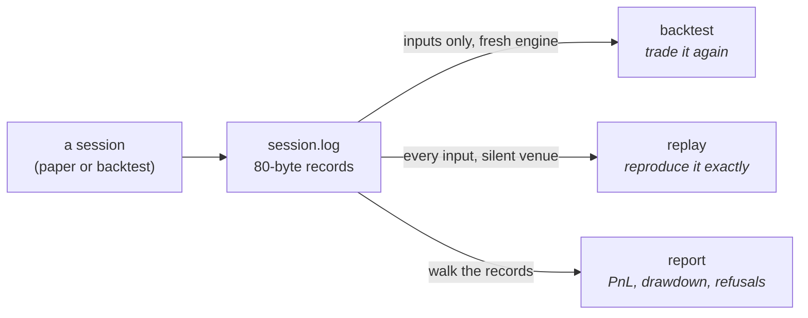
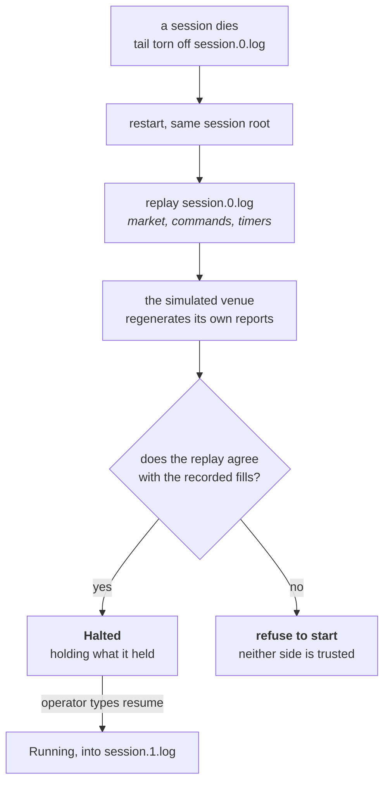
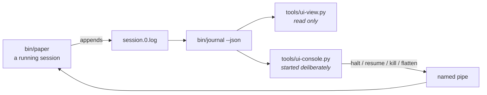

# How the system fits together

Orientation for someone reading this codebase for the first time. It says **what
exists and how the pieces meet**; `ARCHITECTURE.md` says **why the boundaries
are where they are**, and the constitution says what may never change.

Everything below describes code that is on `main` and runs.

---

## 1. Three programs, one engine

There is one trading engine. What makes a run a backtest, a paper session, or a
live session is **which two things get plugged into it at startup** — a feed and
a venue. Nothing below that binding can tell the difference, which is the whole
point (Constitution III).



| Program | Feed | Venue | What it is for |
|---|---|---|---|
| `record` | synthetic | simulated | produce a recording to work with |
| `backtest` | a recording | simulated | run a strategy over past market data |
| `paper` | **live** | simulated | trade a real market with no money at risk |
| *`live`* | live | **real** | not built — it is `paper` with the venue swapped |

`sweep` runs `backtest` many times over one recording and ranks the results
(§7b). Both go through `harness`, so there is one definition of what a backtest
*is* rather than two that can drift on fees or the mark rule.

A fourth binary, `journal`, binds nothing: it reads a recording back and says
what happened (§6).

All three take the same **session config** — what to trade, under what limits,
with which strategies (`examples/kraken.conf`):

```bash
cargo run -p record   -- examples/kraken.conf session.log 2000
cargo run -p backtest -- session.log examples/kraken.conf
cargo run -p paper    -- examples/kraken.conf /tmp/md live.log
cargo run -p journal  -- session.log --fills
```

Give `backtest` the config a recording was made under and it reproduces the
session; give it a different one to ask what another policy would have done over
the same market.

---

## 2. Where market data actually comes from

**The Rust program never opens a network socket.** Not in any binary. This is
the question people ask first, so here is the whole path:



The bridge speaks HTTPS and JSON; the trading system speaks one line per event:

```text
Q <symbol> <exchange_nanos> <bid_px> <bid_qty> <ask_px> <ask_qty>
T <symbol> <exchange_nanos> <px> <qty> <B|S>
L <symbol> <exchange_nanos> <B|S> <px> <qty>     one book level; qty 0 removes it
A <symbol> <exchange_nanos>                      the levels above are now in force
R <symbol> <exchange_nanos>                      discard the book, a snapshot follows
```

**Why the seam is there.** Every venue's wire format is different, so a
venue-specific half is unavoidable. Putting it outside the workspace means a TLS
and websocket stack never enters a real-money binary as a side effect of wanting
market data — the trading system still has **zero third-party dependencies**. A
bridge for a different venue is a new script, not a new crate.

**What it costs, measured.** Both bridges emit the same lines, so the choice is
purely how stale the data is. `journal` now measures that from a recording's own
timestamps:

```text
                    p50        p90        p99        max
  streaming        82ms       163ms     1,046ms    4,153ms
  polling        5,240ms    24,484ms   50,273ms   57,748ms
```

Sixty-four times better at the median and forty-eight at the tail, over 639 and
228 real market events. The polling bridge is kept because it needs nothing but
HTTPS and is useful when a websocket is blocked, but it is no longer the one to
reach for — and its tail is far worse than the "about six seconds" this document
used to claim, which is what happens when a number is estimated instead of
measured.

Streaming makes latency *measurable*. It does not make it *good*: 82ms is a
data path, not a trading edge.

---

## 3. What happens to a single market event

This is the hot path — market data in, order out. It runs on one thread, and it
does not allocate, lock, or make a syscall.



Four things in that picture are load-bearing:

1. **The input is logged before anything reads it.** If the log refuses the
   write, the engine halts — a decision that is not in the log is not
   replayable.
2. **Every decision names the record that caused it.** "Why does this order
   exist" is a lookup, not an investigation.
3. **There is exactly one arrow into the venue, and it goes through the gate.**
   No second path exists; a compile-level test proves the venue cannot be
   reached from outside the engine.
4. **The venue answers by producing new inputs**, not by returning a value. That
   is what puts fills in the log and therefore into replay.

---

## 4. The crates, and who depends on whom

Read from the manifests, not from memory. Dependencies point strictly downward.



`config` points *into* the binaries, not into the engine. The engine is handed
instruments and limits as values; it has never read a file and cannot tell that
one exists. That is what keeps a test able to build a session in three lines.

| Crate | Owns | Notably does **not** know about |
|---|---|---|
| `types` | `Px`, `Qty`, `Notional`, typed clocks, ids, `Instrument` | everything — it has zero dependencies |
| `event` | the event alphabet, the log, the 80-byte record format, the background writer | venues, strategies |
| `marketdata` | top of book, bar aggregation | orders, positions |
| `risk` | limits, the kill switch, the single gate | strategies, feeds |
| `oms` | order state machine, FIFO position accounting, the venue trait | strategies |
| `strategy` | the trait, and two strategies that use opposite halves of the order lifecycle | clocks, sockets, files |
| `engine` | the loop that wires it all — a **library**, no `main` | which venue or feed is bound |
| `adapters/sim` | simulated venue and fill model | feeds |
| `adapters/historical` | a recording, replayed as a feed | orders |
| `adapters/live` | live feed, line protocol, **the one real clock** | venues, orders |
| `report` | log → PnL marked to market, drawdown, refusals | engine internals |
| `config` | the session file — instruments, limits, strategies | the engine, the log, any I/O beyond reading one file |
| `recovery` | bringing a crashed session back, and refusing to when it does not add up | feeds, clocks, which venue is bound |
| `harness` | one configured run over a recording, and splitting one | which tool asked for it |
| `simkit` | scripted feeds and fixtures — test scaffolding only | production adapters |

**27,400 lines, 490 tests, zero third-party dependencies** in the trading path.
`proptest` and `trybuild` are dev-only.

---

## 5. Two things the type system enforces that you cannot see in a diagram

**A price is not a quantity.** `px + qty` does not compile. Neither does
`px * qty` — the product is `px.notional(qty, RoundDir::Down)`, which forces the
caller to say which way it rounds. There is no default rounding anywhere.

**Three clocks that never mix — with one measured exception.** Exchange time
and receive time are on every event and, until rung 8, nothing had ever
compared them: the comparison does not compile. Measuring how stale the feed is
*requires* it, and `CONTEXT.md` names that as the one thing receive time is
for, so there is exactly one function that does it — `types::feed_lag_nanos` —
documented as a measurement that nothing on the order path may call. The count
of sanctioned cross-clock operations is now two, and both are named.

**Three clocks that never mix.** Exchange time, receive time and monotonic time
are different types. Subtracting one from another does not compile. That is why
there is exactly **one** cross-clock conversion in the whole system, in
`adapters/live::project_exchange_time`, with a written note on how it is wrong
and what it must not be used for. The types made it impossible to do by
accident, so doing it on purpose had to be deliberate.

---

## 6. The recording, and why everything is one file format

A session records **every input and every decision** to one file. That single
artifact serves three jobs:



The difference between the first two is the thing most likely to trip you up, so
the code makes you name it: `Replaying::MarketDataOnly` is a **backtest**, and
`Replaying::EveryInput` is a **replay**. Feeding a recording's venue reports back
in *and* binding a simulated venue would deliver every fill twice.

`bin/journal` is the tool that reads one:

```bash
journal session.log            # decisions, and what the venue said back
journal session.log --all      # every record, market data included
journal session.log --fills    # each fill with the running position and profit
journal session.log --curve    # the same as CSV, for plotting
```

It re-derives the books through `oms`'s accounting rather than reimplementing
it, so its numbers cannot drift from the session's. It is also the only check
that a recording is decodable by something *other than the code that wrote it*
— which is what makes "the log is the audit trail" a fact rather than an
intention. A recording whose tail a crash tore off still reads, and says so.

**A session is a chain of files, not one file.** `session.log` names the
session; its records live in `session.0.log`. If a crash tears the tail off
that file, the damaged file is **never written to again** — recovery opens
`session.1.log`, whose first record carries the next sequence number, and the
chain reads back as one gap-free session.

```text
session.0.log   seq 0 … 8_193      torn tail, left exactly as the crash left it
session.1.log   seq 8_194 …        the session continues here
```

Numbering the *first* segment is what makes this safe. If the first segment
were the bare `session.log`, a tool that forgot to look for `session.1.log`
would read part of a session and report it as all of it. Instead the bare path
holds nothing, so that tool fails loudly. Sequence numbers are the engine's
only ordering key, so a chain that restarts at zero or skips a number is not
one session — and `Segments::read_all` refuses it rather than concatenating.

**Why 80 bytes, fixed.** Record *n* sits at `header + n × 80`, so seeking to a
sequence number is arithmetic, and a file that ends mid-record is detectable from
its length alone. Every record carries a CRC and a format version. The header
carries the instrument table, so a recording is interpretable years later without
the config that produced it — and a backtest **refuses** a recording whose
instruments disagree with its own.

---

## 5b. Two strategies, and why the second one is not more arithmetic

`crossover` takes liquidity with market orders. `quote` rests a bid and an ask
around the midpoint and pulls them when the market drifts.

The second one exists to be a different **shape**. A market order is live and
gone inside one event; a resting order has to be named, watched, and cancelled.
Until `quote` existed, everything under that second half — resting orders at
the venue, limit prices through the risk gate, `CancelSubmitted` in the log,
the order machine's `PendingCancel` — was built and had **no production
caller**.

Two seams had to be finished for it to be possible at all:

| Missing | Why it mattered |
|---|---|
| A strategy could not learn its order's id | An order has no id until the gate approves and the venue accepts, so `ctx.order()` cannot return one. Without `StrategyEvent::OrderLive` a strategy could place a resting order and never manage it. |
| A strategy could not cancel | Only the operator's flatten-and-kill sweep could. A quote you cannot pull is a quote that fills on every adverse move. |

A strategy's cancel is recorded separately from the operator's sweep, because
"who pulled this quote" is exactly the sort of question the log exists to
answer. And a cancel is **not** put to the risk gate: pulling an order only
reduces exposure, and a gate that could refuse one is a gate that can trap a
strategy in a position.

---

## 6b. Coming back from a crash

Point `paper` at a session that already exists and it does not refuse and does
not start fresh — it **continues** that session.



Four things in that picture are the whole design:

1. **State comes back by replay, not by installation.** The engine runs its own
   recording through the same path that produced the state the first time. A
   second way to reach a position is a second answer waiting to disagree.
2. **The venue's recorded reports are not replayed.** A simulated venue
   regenerates them from the same market and the same orders, which is what
   rebuilds *the venue* — its book, its resting orders — instead of leaving it
   empty while the engine believes it is trading.
3. **Whatever was resting is cancelled.** Reconstructing the venue brings
   those orders back live, and left alone they keep filling while the session
   is halted — the position moves and nobody decided that it should. The queue
   position is lost, which is the price of coming back to a state somebody
   chose (contract D-3).
4. **That makes reconciliation a real check.** The replay and the recording are
   two independent accounts: one derived by trading forward through the venue,
   one by walking the recorded fills. They are compared per instrument, and a
   disagreement stops the session rather than picking a side.
5. **It comes back halted.** A crash is an incident; leaving a halt is an
   explicit operator decision and never automatic (Constitution V).

Order ids continue rather than restart, because the replay drives the same
counter that issued them.

**What this does not cover: a real venue.** Its reports cannot be regenerated,
so recovery against one has to ask it what it holds and cancel by its list
(contract D-3). None of that is built, and the comparison above is sound
precisely because a *simulated* venue is deterministic.

---

## 6c. What a session was actually worth

A result is realized profit **plus what is still open**, and every session so
far has ended holding something. Reporting realized alone is not conservative,
it is just incomplete — it can be wrong in either direction.

From the two-instrument Kraken session:

```text
  realized     -4.680      what the report used to say
  unrealized   +2.850      the open position, marked
  TOTAL        -1.830      the actual result
  marked at    Mid(Down)   at the last quote of the session
```

The loss was overstated by more than half. The drawdown moved the other way —
6.705 marked, against 5.130 realized-only — because the old measure only
sampled at fills and so missed every fall a session rode out in an open
position, which is most of them.

Three rules make the number trustworthy rather than merely bigger:

1. **The mark rule is the caller's and is printed.** `Mid(Down)` and
   `LastTrade` give different answers over the same log, so a valuation
   without its rule means nothing.
2. **A mark carries the time it was observed.** "Marked at what, as of when" is
   the difference between a number and a number somebody can check.
3. **A position that cannot be valued is named, never counted as zero.** Zero
   is a number people add up. The total then says it is incomplete.

The book is rebuilt from the log to get the mark, so the report cannot disagree
with the session about what a price was — including which events the book
*refused* as out of order.

---

## 6d. What size costs

Until depth, every recording carried **top of book only**, so a fill model
could not answer the one question that matters to a strategy trading size:
what happens to the part of my order that is bigger than the touch?

A book update is a run of records — one per changed level, then a marker that
puts the whole update in force. Ten levels a side does not fit an 80-byte
record and the fixed size is what makes seeking arithmetic, so the run is the
compromise (`adr/1-order-book-depth.md`). **Nothing downstream ever sees half an
update**: part-way through, the best bid can sit above the best ask, and a
crossed book is a state the venue never published.

`FillModel::WalkBook` then eats levels outwards, each at its own price. On a
synthetic book with 2 at the touch and 8 behind it, a strategy asking for 5:

```text
                  orders  fills  ends at
  TouchDisplayed      49     49   +2.000   never reaches its target size
  WalkBook            12     24   -5.000   gets there, and pays for it
```

The old model is not merely optimistic — under it the strategy **could not
execute at all**, so it re-ordered the shortfall forty-nine times and the
backtest was quietly measuring a smaller strategy than the one configured.

**A wrong book is caught, not carried.** Depth is a stream of deltas, so one
dropped update leaves a book that is *quietly* wrong — plausible prices,
incorrect sizes, and a fill model that walks them without complaint. Venues
publish a checksum for exactly this, and the bridge keeps its own copy of the
book to check against it:

```text
  book resets        1                    the subscription opening: ordinary
  !! BOOK RESYNCS    1 — the venue caught a wrong book that many times
```

The check lives in the bridge because the algorithm is venue-specific down to
how many digits a price is formatted with — putting it in the Rust path would
drag Kraken's conventions into a real-money binary. When it fails the bridge
resynchronises, and the `R` line that opens the fresh snapshot tells the engine
to discard everything it holds, including any half-built update. A reset that
arrives *after* data has flowed is counted separately, because only that one
means decisions were taken against a book that was wrong.

**Queue position is the other thing depth made fixable.** A resting order used
to fill on the first print at its price — the simulator assuming it was always
first in the queue, which flatters exactly one strategy shape: passive quoting,
whose entire profit is resting fills. With depth we know how much was already
at a price when an order joined it, so `--queue-behind` makes the order wait
that size out. On a quoter joining a level with four ahead of it:

```text
                    fills   position   total
  front of queue      200        200   +20.00
  behind the queue     66         66    +6.60
```

Three times fewer fills and a third of the profit. The queue only shortens on
**trades**, never on cancellations: a level shrinking says somebody left, not
whether they were ahead of us, and assuming they were would hand back fills
nobody earned. That is pessimistic, and stated rather than tuned.

**What it still does not buy**: market impact (the book would not have sat
still while we ate it), hidden liquidity, and any latency between deciding and
arriving. Walking a recorded book and waiting in its queue is strictly less
wrong than assuming the touch is infinite and yours. It is not right.

---

## 7. Verified end to end

A live paper session against Kraken — **two instruments at once** — and then a
backtest of its own recording, under the same config file:

```text
                     live      backtest of its recording
  orders               19            19
  refused               0             0
  XBTUSD realized   -4.600        -4.705      position -0.500 both
  ETHUSD realized   -0.080        -0.290      position +5.000 both
  fees               0.000         0.315
```

−4.600 − 0.105 = −4.705 and −0.080 − 0.210 = −0.290, and those two fee figures
sum to the 0.315 reported. Same orders, same refusals, same final position on
each book; the entire difference is the fees the backtest charges and the paper
session did not. Parity is demonstrated against real market data, per
instrument, rather than asserted.

An earlier single-instrument session, before the config existed, showed the
same thing on one book: 80 orders each side, one `StaleMarketData` refusal each
side, −16.60 − 1.49 = −18.09.

---

## 7b. Choosing between configurations, without fooling yourself

```bash
sweep session.log base.conf --vary BTCUSD.half-spread=0.25,0.5,0.75 --split 0.7
```

Runs the grid, ranks it by what each variant was **worth** (total, not realized
— a run still holding a position has not finished), and prints an
out-of-sample column beside the in-sample one.

That second column is the whole point. **Picking the top row of a sweep is how
strategies get overfitted**: run enough variants over one recording and the
winner is partly measuring the noise in that particular stretch. The tool
cannot prevent that, so it makes it visible — and when the ranking rearranges
it says so:

```text
!! The ranking rearranged. In sample the best was half-spread=0.5; out of
!! sample it returned 8.945 and half-spread=0.4 did better.
```

That is a real run of this tool, not an illustration. A sweep with no `--split`
prints a paragraph explaining why the table it just printed should not be
trusted on its own.

The split is by **market event**, not record index: decisions and venue reports
cluster around active moments, so cutting on record count would hand the busier
half of the session to whichever side had more trading in it.

**What it is not.** One split is one experiment. A parameter that survives six
consecutive train/test windows is a different quality of evidence, and rolling
walk-forward is not built.

---

## 7c. Somewhere to look

```bash
python3 tools/ui-view.py session.log                       # read-only, :8080
python3 tools/ui-console.py session.log --commands /tmp/ctl # + buttons, :8081
```



Four rules, from `adr/1-operator-ui-contract.md`, and each is visible in that
picture:

1. **Nothing is in the Rust workspace.** Both servers are Python standard
   library; the page loads nothing from the internet and renders its own SVG.
   The trading path still has zero third-party dependencies.
2. **The UI never decodes a recording.** It calls `journal --json`. The format
   has been bumped three times, and a second decoder would go quietly wrong the
   first time it moved again.
3. **Viewing and controlling are two programs.** The viewer has no write path
   at all — a `POST` to it is refused with a message pointing at the console.
   So the thing left open on a second monitor is not the thing that can flatten
   a book.
4. **A command is pending until the recording says otherwise.** Writing a line
   to the pipe means the line was written, not that the engine acted. The page
   watches for the engine's own record of it, and `flatten` is never retried
   automatically because it is the one command that is not idempotent.

Money crosses that boundary as **strings**, never JSON numbers. A JSON number
is a double, and a fixed-point price through one comes back a different price —
the same round trip the bridge avoids.

---

## 8. What is not built

So the map is not mistaken for the territory:

| Missing | Consequence |
|---|---|
| `bin/live` and a real venue adapter | nothing can lose money yet, by construction |
| Crash recovery against a **real** venue | D-1, D-2, D-3 and a simulated-venue form of D-4 are built (§6b). D-3 cancels what the *reconstructed* venue holds; against a real one it has to ask the venue for its open orders instead, and no real venue exists to ask. A `Recovering` engine state (D-6) would also be a wire-format change, so it waits for that work. |
| `client` | operator commands come from stdin; there is no separate UI process |
| Latency budget | no budget is declared. `cargo bench -p engine` now measures the hot path (~88 ns/event, one instrument, one strategy) so changes can be compared, but nothing says what the number is *allowed* to be. End-to-end latency still cannot be measured at all: the REST bridge is ~6s behind the market. |
| Duplicate market events | out-of-order events are refused; duplicates need a venue sequence number no feed has given us yet |
| More strategies | two kinds exist, `crossover` and `quote`. They were chosen to be different *shapes* rather than different arithmetic; a third would be research, and research enters through a spec. |
| A session start time in the log header | the header has the field; both writers leave it zero, because at that moment no exchange clock has been observed and a receive time is not one. `journal` derives the span from the records instead. |
