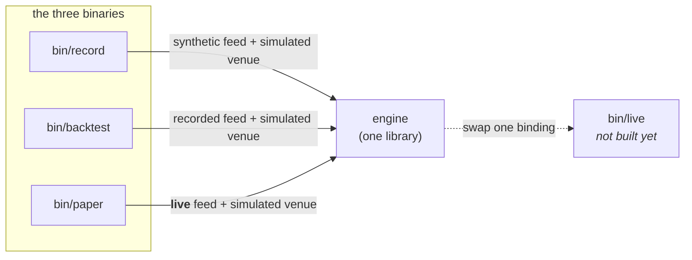
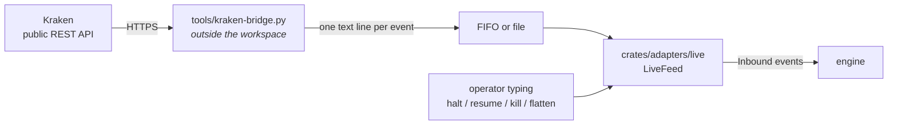
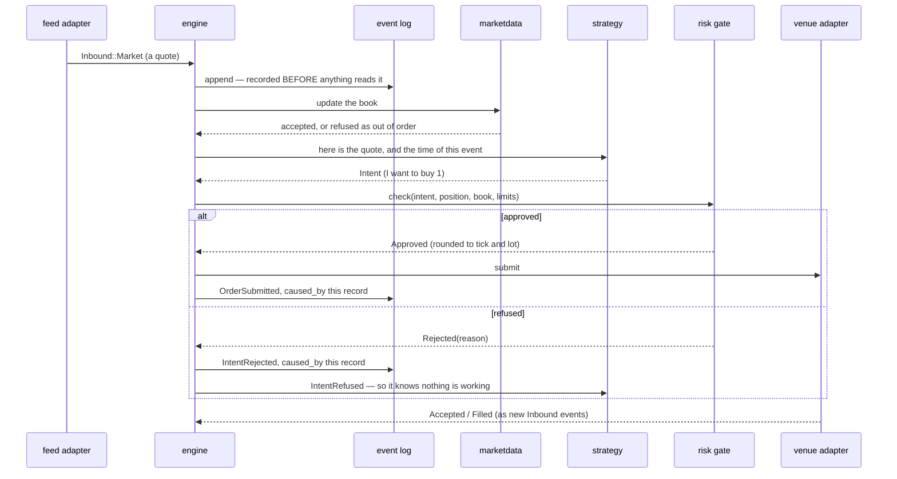
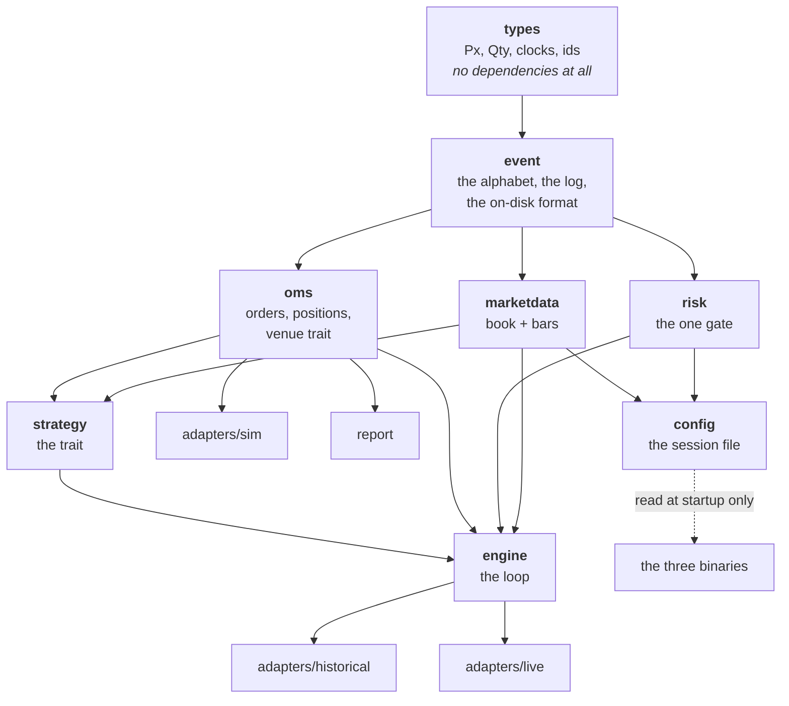
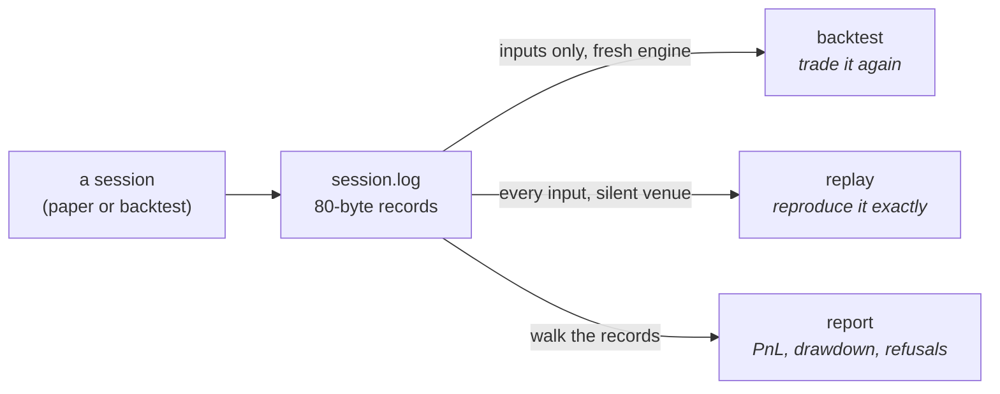

# How the system fits together

Orientation for someone reading this codebase for the first time. It says **what
exists and how the pieces meet**; `ARCHITECTURE.md` says **why the boundaries
are where they are**, and the constitution says what may never change.

Everything below describes code that is on `main` and runs.

---

## 1. Three programs, one engine

There is one trading engine. What makes a run a backtest, a paper session, or a
live session is **which two things get plugged into it at startup** — a feed and
a venue. Nothing below that binding can tell the difference, which is the whole
point (Constitution III).



| Program | Feed | Venue | What it is for |
|---|---|---|---|
| `record` | synthetic | simulated | produce a recording to work with |
| `backtest` | a recording | simulated | run a strategy over past market data |
| `paper` | **live** | simulated | trade a real market with no money at risk |
| *`live`* | live | **real** | not built — it is `paper` with the venue swapped |

A fourth binary, `journal`, binds nothing: it reads a recording back and says
what happened (§6).

All three take the same **session config** — what to trade, under what limits,
with which strategies (`examples/kraken.conf`):

```bash
cargo run -p record   -- examples/kraken.conf session.log 2000
cargo run -p backtest -- session.log examples/kraken.conf
cargo run -p paper    -- examples/kraken.conf /tmp/md live.log
cargo run -p journal  -- session.log --fills
```

Give `backtest` the config a recording was made under and it reproduces the
session; give it a different one to ask what another policy would have done over
the same market.

---

## 2. Where market data actually comes from

**The Rust program never opens a network socket.** Not in any binary. This is
the question people ask first, so here is the whole path:



The bridge speaks HTTPS and JSON; the trading system speaks one line per event:

```text
Q <symbol> <exchange_nanos> <bid_px> <bid_qty> <ask_px> <ask_qty>
T <symbol> <exchange_nanos> <px> <qty> <B|S>
```

**Why the seam is there.** Every venue's wire format is different, so a
venue-specific half is unavoidable. Putting it outside the workspace means a TLS
and websocket stack never enters a real-money binary as a side effect of wanting
market data — the trading system still has **zero third-party dependencies**. A
bridge for a different venue is a new script, not a new crate.

**What it costs, measured.** Polling REST rather than reading a stream puts the
data path about **6 seconds behind the market** (median, with a 3-second poll;
max 37s observed). Fine for paper. Disqualifying for any latency work, which is
worth knowing before anyone tries to measure a latency budget.

---

## 3. What happens to a single market event

This is the hot path — market data in, order out. It runs on one thread, and it
does not allocate, lock, or make a syscall.



Four things in that picture are load-bearing:

1. **The input is logged before anything reads it.** If the log refuses the
   write, the engine halts — a decision that is not in the log is not
   replayable.
2. **Every decision names the record that caused it.** "Why does this order
   exist" is a lookup, not an investigation.
3. **There is exactly one arrow into the venue, and it goes through the gate.**
   No second path exists; a compile-level test proves the venue cannot be
   reached from outside the engine.
4. **The venue answers by producing new inputs**, not by returning a value. That
   is what puts fills in the log and therefore into replay.

---

## 4. The crates, and who depends on whom

Read from the manifests, not from memory. Dependencies point strictly downward.



`config` points *into* the binaries, not into the engine. The engine is handed
instruments and limits as values; it has never read a file and cannot tell that
one exists. That is what keeps a test able to build a session in three lines.

| Crate | Owns | Notably does **not** know about |
|---|---|---|
| `types` | `Px`, `Qty`, `Notional`, typed clocks, ids, `Instrument` | everything — it has zero dependencies |
| `event` | the event alphabet, the log, the 80-byte record format, the background writer | venues, strategies |
| `marketdata` | top of book, bar aggregation | orders, positions |
| `risk` | limits, the kill switch, the single gate | strategies, feeds |
| `oms` | order state machine, FIFO position accounting, the venue trait | strategies |
| `strategy` | the trait, one reference strategy | clocks, sockets, files |
| `engine` | the loop that wires it all — a **library**, no `main` | which venue or feed is bound |
| `adapters/sim` | simulated venue and fill model | feeds |
| `adapters/historical` | a recording, replayed as a feed | orders |
| `adapters/live` | live feed, line protocol, **the one real clock** | venues, orders |
| `report` | log → PnL, drawdown, refusals | engine internals |
| `config` | the session file — instruments, limits, strategies | the engine, the log, any I/O beyond reading one file |
| `simkit` | scripted feeds and fixtures — test scaffolding only | production adapters |

**21,400 lines, 396 tests, zero third-party dependencies** in the trading path.
`proptest` and `trybuild` are dev-only.

---

## 5. Two things the type system enforces that you cannot see in a diagram

**A price is not a quantity.** `px + qty` does not compile. Neither does
`px * qty` — the product is `px.notional(qty, RoundDir::Down)`, which forces the
caller to say which way it rounds. There is no default rounding anywhere.

**Three clocks that never mix.** Exchange time, receive time and monotonic time
are different types. Subtracting one from another does not compile. That is why
there is exactly **one** cross-clock conversion in the whole system, in
`adapters/live::project_exchange_time`, with a written note on how it is wrong
and what it must not be used for. The types made it impossible to do by
accident, so doing it on purpose had to be deliberate.

---

## 6. The recording, and why everything is one file format

A session records **every input and every decision** to one file. That single
artifact serves three jobs:



The difference between the first two is the thing most likely to trip you up, so
the code makes you name it: `Replaying::MarketDataOnly` is a **backtest**, and
`Replaying::EveryInput` is a **replay**. Feeding a recording's venue reports back
in *and* binding a simulated venue would deliver every fill twice.

`bin/journal` is the tool that reads one:

```bash
journal session.log            # decisions, and what the venue said back
journal session.log --all      # every record, market data included
journal session.log --fills    # each fill with the running position and profit
journal session.log --curve    # the same as CSV, for plotting
```

It re-derives the books through `oms`'s accounting rather than reimplementing
it, so its numbers cannot drift from the session's. It is also the only check
that a recording is decodable by something *other than the code that wrote it*
— which is what makes "the log is the audit trail" a fact rather than an
intention. A recording whose tail a crash tore off still reads, and says so.

**A session is a chain of files, not one file.** `session.log` names the
session; its records live in `session.0.log`. If a crash tears the tail off
that file, the damaged file is **never written to again** — recovery opens
`session.1.log`, whose first record carries the next sequence number, and the
chain reads back as one gap-free session.

```text
session.0.log   seq 0 … 8_193      torn tail, left exactly as the crash left it
session.1.log   seq 8_194 …        the session continues here
```

Numbering the *first* segment is what makes this safe. If the first segment
were the bare `session.log`, a tool that forgot to look for `session.1.log`
would read part of a session and report it as all of it. Instead the bare path
holds nothing, so that tool fails loudly. Sequence numbers are the engine's
only ordering key, so a chain that restarts at zero or skips a number is not
one session — and `Segments::read_all` refuses it rather than concatenating.

**Why 80 bytes, fixed.** Record *n* sits at `header + n × 80`, so seeking to a
sequence number is arithmetic, and a file that ends mid-record is detectable from
its length alone. Every record carries a CRC and a format version. The header
carries the instrument table, so a recording is interpretable years later without
the config that produced it — and a backtest **refuses** a recording whose
instruments disagree with its own.

---

## 7. Verified end to end

A live paper session against Kraken — **two instruments at once** — and then a
backtest of its own recording, under the same config file:

```text
                     live      backtest of its recording
  orders               19            19
  refused               0             0
  XBTUSD realized   -4.600        -4.705      position -0.500 both
  ETHUSD realized   -0.080        -0.290      position +5.000 both
  fees               0.000         0.315
```

−4.600 − 0.105 = −4.705 and −0.080 − 0.210 = −0.290, and those two fee figures
sum to the 0.315 reported. Same orders, same refusals, same final position on
each book; the entire difference is the fees the backtest charges and the paper
session did not. Parity is demonstrated against real market data, per
instrument, rather than asserted.

An earlier single-instrument session, before the config existed, showed the
same thing on one book: 80 orders each side, one `StaleMarketData` refusal each
side, −16.60 − 1.49 = −18.09.

---

## 8. What is not built

So the map is not mistaken for the territory:

| Missing | Consequence |
|---|---|
| `bin/live` and a real venue adapter | nothing can lose money yet, by construction |
| Crash recovery, the *policy* | the contract is written (`adr/1-crash-recovery-contract.md`) and its D-1 — the segment chain — is built. What is missing is D-2 to D-4: a restart does not yet rebuild its position, start halted, or reconcile against the venue. No binary opens a second segment yet. |
| `client` | operator commands come from stdin; there is no separate UI process |
| Latency budget | never measured. The feed is ~6s behind the market, so it cannot be measured with this bridge. |
| Duplicate market events | out-of-order events are refused; duplicates need a venue sequence number no feed has given us yet |
| Per-strategy config beyond the crossover | one strategy kind exists, so `strategy crossover` is the only form the config accepts |
| A session start time in the log header | the header has the field; both writers leave it zero, because at that moment no exchange clock has been observed and a receive time is not one. `journal` derives the span from the records instead. |
