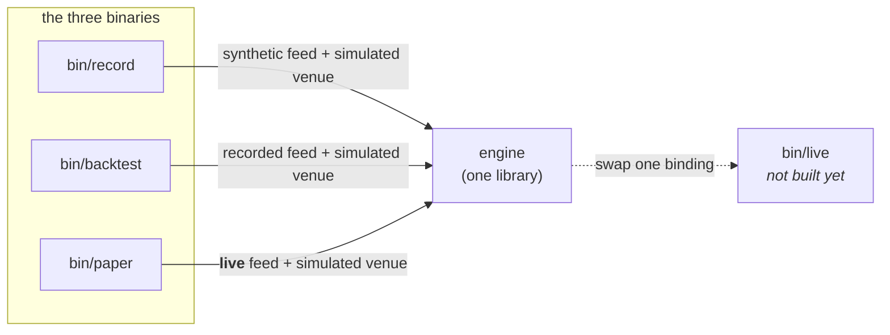
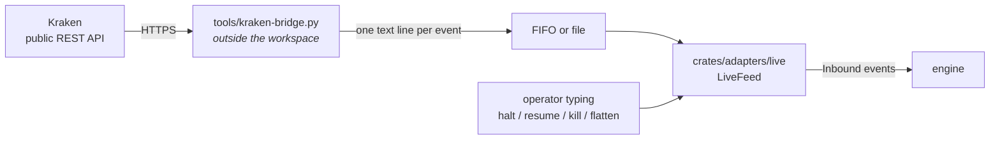
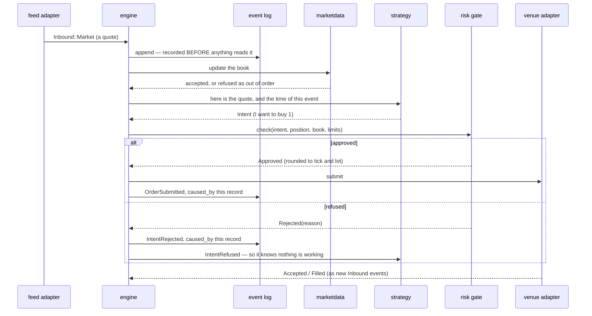
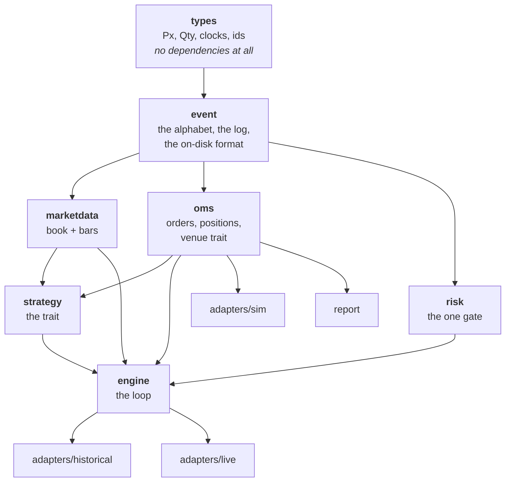
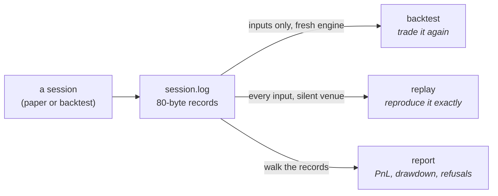

# How the system fits together

Orientation for someone reading this codebase for the first time. It says **what
exists and how the pieces meet**; `ARCHITECTURE.md` says **why the boundaries
are where they are**, and the constitution says what may never change.

Everything below describes code that is on `main` and runs.

---

## 1. Three programs, one engine

There is one trading engine. What makes a run a backtest, a paper session, or a
live session is **which two things get plugged into it at startup** — a feed and
a venue. Nothing below that binding can tell the difference, which is the whole
point (Constitution III).



| Program | Feed | Venue | What it is for |
|---|---|---|---|
| `record` | synthetic | simulated | produce a recording to work with |
| `backtest` | a recording | simulated | run a strategy over past market data |
| `paper` | **live** | simulated | trade a real market with no money at risk |
| *`live`* | live | **real** | not built — it is `paper` with the venue swapped |

```bash
cargo run -p record   -- session.log 2000          # make a recording
cargo run -p backtest -- session.log               # run a strategy over it
cargo run -p paper    -- XBTUSD /tmp/md live.log 0.1 0.00000001
```

---

## 2. Where market data actually comes from

**The Rust program never opens a network socket.** Not in any binary. This is
the question people ask first, so here is the whole path:



The bridge speaks HTTPS and JSON; the trading system speaks one line per event:

```text
Q <symbol> <exchange_nanos> <bid_px> <bid_qty> <ask_px> <ask_qty>
T <symbol> <exchange_nanos> <px> <qty> <B|S>
```

**Why the seam is there.** Every venue's wire format is different, so a
venue-specific half is unavoidable. Putting it outside the workspace means a TLS
and websocket stack never enters a real-money binary as a side effect of wanting
market data — the trading system still has **zero third-party dependencies**. A
bridge for a different venue is a new script, not a new crate.

**What it costs, measured.** Polling REST rather than reading a stream puts the
data path about **6 seconds behind the market** (median, with a 3-second poll;
max 37s observed). Fine for paper. Disqualifying for any latency work, which is
worth knowing before anyone tries to measure a latency budget.

---

## 3. What happens to a single market event

This is the hot path — market data in, order out. It runs on one thread, and it
does not allocate, lock, or make a syscall.



Four things in that picture are load-bearing:

1. **The input is logged before anything reads it.** If the log refuses the
   write, the engine halts — a decision that is not in the log is not
   replayable.
2. **Every decision names the record that caused it.** "Why does this order
   exist" is a lookup, not an investigation.
3. **There is exactly one arrow into the venue, and it goes through the gate.**
   No second path exists; a compile-level test proves the venue cannot be
   reached from outside the engine.
4. **The venue answers by producing new inputs**, not by returning a value. That
   is what puts fills in the log and therefore into replay.

---

## 4. The crates, and who depends on whom

Read from the manifests, not from memory. Dependencies point strictly downward.



| Crate | Owns | Notably does **not** know about |
|---|---|---|
| `types` | `Px`, `Qty`, `Notional`, typed clocks, ids, `Instrument` | everything — it has zero dependencies |
| `event` | the event alphabet, the log, the 80-byte record format, the background writer | venues, strategies |
| `marketdata` | top of book, bar aggregation | orders, positions |
| `risk` | limits, the kill switch, the single gate | strategies, feeds |
| `oms` | order state machine, FIFO position accounting, the venue trait | strategies |
| `strategy` | the trait, one reference strategy | clocks, sockets, files |
| `engine` | the loop that wires it all — a **library**, no `main` | which venue or feed is bound |
| `adapters/sim` | simulated venue and fill model | feeds |
| `adapters/historical` | a recording, replayed as a feed | orders |
| `adapters/live` | live feed, line protocol, **the one real clock** | venues, orders |
| `report` | log → PnL, drawdown, refusals | engine internals |
| `simkit` | scripted feeds and fixtures — test scaffolding only | production adapters |

**19,600 lines, 358 tests, zero third-party dependencies** in the trading path.
`proptest` and `trybuild` are dev-only.

---

## 5. Two things the type system enforces that you cannot see in a diagram

**A price is not a quantity.** `px + qty` does not compile. Neither does
`px * qty` — the product is `px.notional(qty, RoundDir::Down)`, which forces the
caller to say which way it rounds. There is no default rounding anywhere.

**Three clocks that never mix.** Exchange time, receive time and monotonic time
are different types. Subtracting one from another does not compile. That is why
there is exactly **one** cross-clock conversion in the whole system, in
`adapters/live::project_exchange_time`, with a written note on how it is wrong
and what it must not be used for. The types made it impossible to do by
accident, so doing it on purpose had to be deliberate.

---

## 6. The recording, and why everything is one file format

A session records **every input and every decision** to one file. That single
artifact serves three jobs:



The difference between the first two is the thing most likely to trip you up, so
the code makes you name it: `Replaying::MarketDataOnly` is a **backtest**, and
`Replaying::EveryInput` is a **replay**. Feeding a recording's venue reports back
in *and* binding a simulated venue would deliver every fill twice.

**Why 80 bytes, fixed.** Record *n* sits at `header + n × 80`, so seeking to a
sequence number is arithmetic, and a file that ends mid-record is detectable from
its length alone. Every record carries a CRC and a format version. The header
carries the instrument table, so a recording is interpretable years later without
the config that produced it — and a backtest **refuses** a recording whose
instruments disagree with its own.

---

## 7. Verified end to end

A live paper session against Kraken, then a backtest of its own recording:

```text
                  live       backtest of its recording
  orders            80             80
  refused            1              1     StaleMarketData, both
  position      +1.000         +1.000
  realized      -16.60         -18.09
  fees            0.00           1.49
```

−16.60 − 1.49 = −18.09, to the scale unit. Same decisions, same refusal and the
same reason, same final position; the entire difference is the fees the backtest
charges and the paper session did not. That is backtest/live parity demonstrated
against real market data rather than asserted.

---

## 8. What is not built

So the map is not mistaken for the territory:

| Missing | Consequence |
|---|---|
| `bin/live` and a real venue adapter | nothing can lose money yet, by construction |
| Crash recovery | the contract is written (`adr/1-crash-recovery-contract.md`), the code is not. A restart does not reconcile against the venue. |
| `client` | operator commands come from stdin; there is no separate UI process |
| Latency budget | never measured. The feed is ~6s behind the market, so it cannot be measured with this bridge. |
| Duplicate market events | out-of-order events are refused; duplicates need a venue sequence number no feed has given us yet |
| Config files | instruments and risk limits are command-line arguments and constants in the binaries |
